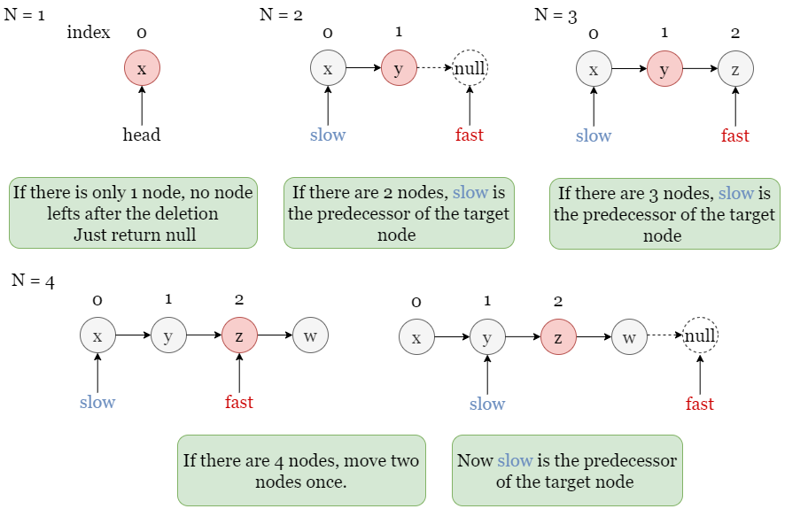

# 2095. Delete the Middle Node of a Linked List

## The Problem

You are given the ```head``` of a linked list. Delete the middle node, and return the ```head``` of the modified linked list.

The **middle node** of a linked list of size ```n``` is the ```⌊n / 2⌋th``` node from the start using **0-based** indexing, where ```⌊x⌋``` denotes the largest integer less than or equal to ```x```.

* For ```n = 1, 2, 3, 4, and 5```, the middle nodes are ```0, 1, 1, 2, and 2```, respectively.

**Breakdown**

middle index = floor(n / 2);


### Initial Approach
I am thinking that I can use a similar approach to deleteNodeAt(index) where you walk through this list searching for a node at a given index in the linked list and delete it.

However in this problem, the only index we care about is the middle index of the list.

**Steps to try**
* The middle node of the linked lists should be the floored value of n/2.
	* While doing so, keep a reference to the previous pointer.
* Walk the list until we find the middle index node.
* If the middle node's next pointer is null, assign previous nodes next pointer to null.
* other wise, point the prev nodes next pointer to the middle nodes next pointer.
* **NOTE**: If the list only has 1 delete the node, meaning assign null to head.
* Return the head.


### My Solution

```javascript
/**
 * Definition for singly-linked list.
 * function ListNode(val, next) {
 *     this.val = (val===undefined ? 0 : val)
 *     this.next = (next===undefined ? null : next)
 * }
 */
function getSize(head) {
    let count = 0;
    let curr = head;
    while(curr) {
        count++;
        curr = curr.next;
    };
    return count;
}
/**
 * @param {ListNode} head
 * @return {ListNode}
 */
var deleteMiddle = function(head) {
    let pos = 0;
    let n = getSize(head);
    let mid = Math.floor(n / 2);

    if(n === 1) head = null;

    let curr = head;
    while(curr !== null) {
        // Walk to the node just before the middle node
        if(pos === mid - 1) {
            if(curr.next) {
                curr.next = curr.next.next;
            }
            else {
                curr.next = null;
            }
        };
        curr = curr.next;
        pos++;
    }
    return head;
};
```
**Time Complexity**: O(n), we visit each node to get the size of the list  
**Space Complexity**: O(1), the size is stored in a constant variable.

### Alternative Solutions

**Fast Pointer, Slow Pointer Technique**  
  

The *fast pointer and slow pointer* are two pointers used in computer science to traverse data structures such as **linked lists** and **graphs**.
The fast pointer moves at a faster rate than the slow pointer, allowing the algorithm to detect certain patterns or properties more quickly.
  
For example, the fast and slow pointer technique can be used to detect cycles in linked lists.
The basic idea is to move the fast pointer two nodes at a time and the slow pointer one node at a time.
If the two pointers ever meet, then there is a cycle in the linked list. Otherwise, there is no cycle.
  
The fast and slow pointer technique can also be used to find the middle node of a linked list.
To do this, simply start the fast pointer at the head of the linked list and the slow pointer at the tail of the linked list.
Then, move the fast pointer two nodes at a time and the slow pointer one node at a time.
When the fast pointer meets the slow pointer, the slow pointer will be pointing to the middle node of the linked list.
  
**Finding The Middle Node**
> 

**Solution**

```javascript
/**
 * @param {ListNode} head
 * @return {ListNode}
 */
var deleteMiddle = function(head) {
    if(head.next === null) return null;
    let slow = head;
    let fast = head.next.next;
    while(fast && fast.next) {
        slow = slow.next;
        fast = fast.next.next;
    };
    slow.next = slow.next.next;
    return head;
};
```
